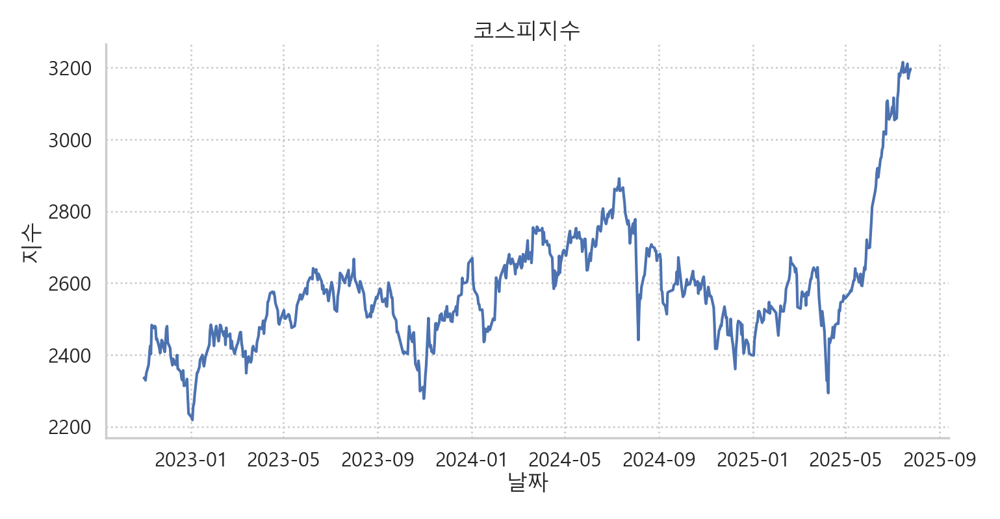

# 📈 주요 경제지표 분석 프로젝트

> 한국은행 API 기반 데이터로 금리, 환율, 주가지수 등을 시각화하고,  
> 시장 흐름 속 경제 지표 간 관계를 인사이트로 정리한 프로젝트입니다.


---

## 🗂️ 프로젝트 구성

```
economic_indicator/
├── visualise.py # 데이터 시각화
├── financial_ralationship.py # 상관관계 시각화
├── utils/
│ ├── preprocess.py    # 경로 로드 및 api 정보 작성, 데이터 불러오기
│ └── economic_data.py   # 데이터 불러오기(ecnomic_data, bond_data)
├── output/
│ ├── total_data.xlsx    # 기준금리, 국고채, 회사채, 코스피지수, 원달러환율 데이터
│ ├── kospi.png   # 코스피 그래프
│ ├── economic_indicator.png    #  국고채, 회사채, 코스피지수, 원달러환율 그래프
│ ├── corr_heatmap.png   # 경제 지표간의 상관관계 히트맵
│ ├── bond_data.xlsx    # 국고채, 회사채 데이터
│ └── bond.png    # 국고채(3년), 회사채(3년, AA-) 비교 그래프 
└── README.md
```

---

## 🔍 데이터 한눈에 보기

| 지표명               | 의미                                                  |
|---------------------|-----------------------------------------------------|
| **기준금리**          | 한국은행 대표 금리. 경제 전반의 자금 비용을 좌우함. 시중 은행의 대출 및 예금 금리를 결정         |
| **국고채**            | 정부가 발행하는 안전자산 채권, 경제 상황에 따라 금리 변동.     |
| **회사채 (AA-)**      | 기업 발행 채권, 신용등급에 따라 금리와 위험도가 다름.          |
| **코스피지수**         | 코스피 시장에 상장된 주식의 전체적인 가격 변동. 투자심리와 경제 상황 반영.           |
| **원달러환율**          | 원화와 달러간 교환 비율, 수출입과 금융시장에 영향력 큼.(환율이 낮으면 원화의 가치가 높음)            |
| **국고채 (3년 만기)**   | 3년 만기 국고채 금리, 단기/중기 금리 분석에 사용.              |
| **회사채 (3년 만기, AA-)** | 3년 만기 AA- 등급 회사채 금리, 중간 신용등급 기업 신용 상태 반영. |

---

## 📊 시각화 & 인사이트

### 1️⃣ **코스피 지수 추이 (라인 그래프)**  


- **인사이트:**  
  최근 급등세를 보이며 3200선을 돌파.  
  이는 금리 하락과 외국인 순매수의 영향으로 해석 가능.  
  중간중간 큰 하락 구간은 금리 인상기 및 환율 급등기와 연관.

---

### 2️⃣ **주요 경제지표 개별 추이 (4분할 차트)**  


- **포함 지표:**  
  `국고채`, `회사채`, `코스피지수`, `원달러환율`

- **인사이트:**  
  - 금리는 **2023년 중반 이후 하향 안정세**  
  - 원달러환율은 **2024년부터 완만한 하락세**, 외국인 자금 유입 유리  
  - 코스피는 **2024년 중후반부터 상승세 뚜렷**  
  → **시장에 ‘완화적 신호’가 작용하고 있음**.

---

### 3️⃣ **국고채(3년) vs 회사채(3년, AA-) 금리 비교**  


- **인사이트:**  
  - 두 금리 모두 2022년~2023년 중반까지 급등, 이후 하락 전환  
  - **회사채 금리가 국고채보다 항상 높음** → 위험 프리미엄 존재  
  - 스프레드가 **경기 불안기(2022 후반~2023 초반)에 확대**  
    → 시장이 **기업 신용위험을 더 크게 인식**했던 시기

---

## 🔍 핵심 인사이트 요약

- **금리 하락 → 코스피 상승 + 환율 안정**
- **회사채 vs 국고채 스프레드**는 신용위험 신호로 유용
- **2022~2023 상반기:** 고금리·고환율·저성장 압박
- **2024~2025:** 시장 전반의 완화 흐름이 시작됨

---
## 📈 추가 분석: 금융지표 간 상관관계 해석


금융지표들 간의 상관관계를 시각화하기 위해 상관관계 히트맵을 생성하였습니다.  
아래는 분석 결과를 바탕으로 도출할 수 있는 주요 인사이트입니다:

### 🔍 주요 인사이트

| 항목 1 | 항목 2 | 상관계수 | 해석 |
|--------|--------|----------|------|
| 회사채(3년, AA-) | 국고채(3년) | **+0.93** | 매우 강한 양의 상관관계. 채권시장 내 금리 흐름이 거의 유사하게 작동함. |
| 기준금리 | 국고채(3년) | **+0.72** | 기준금리 인상이 장기 금리 상승으로 이어지는 통화정책의 전달 경로 확인 가능. |
| KOSPI | 회사채(3년, AA-) | **-0.52** | 금리 상승 시 증시 하락 경향. 위험 회피 성향이 반영된 움직임으로 해석 가능. |
| 기준금리 | 원/달러 환율 | **-0.61** | 기준금리 상승 → 원화 강세(환율 하락). 외국인 자금 유입의 영향 가능성. |
| KOSPI | 기준금리 | **-0.31** | 약한 음의 상관관계. 금리 변화가 증시에 미치는 영향은 제한적이지만 존재함. |


### 💡 종합 정리

- **채권시장 내 금리 간 높은 상관성**은 금융시장 구조의 일관성과 금리 정책의 유효성을 보여줍니다.
- **기준금리 변화는 환율 및 채권금리에 강한 영향을 미치지만**, 주식시장(KOSPI)과는 중간 정도의 관계를 가집니다.
- **환율과 채권금리 간 음의 상관관계**는 금리 정책이 통화가치에 미치는 영향과 글로벌 자금 흐름의 반응을 반영합니다.


### 📌 참고

- 상관계수 범위: **-1 ~ +1**
  - `+1`: 완전한 양의 상관관계
  - ` 0`: 무상관 (관계 없음)
  - `-1`: 완전한 음의 상관관계
- **상관관계는 인과관계를 의미하지 않음**. 다른 변수들과의 복합적 해석이 필요함.


---
## 📈 추가분석: 환율 vs KOSPI 버블차트 분석


이 버블차트는 주요 거시지표인 환율, KOSPI, 기준금리 간의 관계를 시각적으로 표현한 것입니다.  
다음과 같은 축과 요소로 구성되어 있습니다:

X축: 원/달러 환율 (높을수록 원화 가치 하락)

Y축: KOSPI 지수 (국내 주식시장 지표)

버블 크기: 기준금리 (한국은행 기준금리 수준)

버블 색상: 기준금리 구간별 색상 분류
  - 2.0% ~ 2.5% → 녹색

  - 2.5% ~ 3.0% → 파란색

  - 3.0% ~ 3.5% → 빨간색

### 🔍 주요 인사이트
1. 저금리 환경에서는 KOSPI가 상대적으로 높게 유지됨
**녹색 버블 (2.0~2.5%)**은 KOSPI 3000 이상 구간에 집중

이는 저금리 환경이 주식시장에 긍정적 영향을 미쳤음을 시사

2. 고금리 구간에서는 KOSPI가 낮고 환율은 더 넓게 분포
**빨간색 버블 (3.0~3.5%)**은 KOSPI 2200~2700 사이에 밀집

고금리가 주식시장 하락과 연관될 수 있음을 보여줌

동시에 환율 분포가 넓어져, 시장 불확실성이 컸던 시기로 해석 가능

3. 환율과 KOSPI 간 뚜렷한 선형 관계는 보이지 않음
데이터 포인트들이 직선이나 곡선 경향 없이 퍼져 있음

비선형 관계 가능성 혹은 **외생 변수(글로벌 금융 환경, 지정학적 리스크 등)**의 영향 추정

4. 버블 크기로 표현한 기준금리는 시각적 구분이 약함
기준금리 구간이 제한적이고 수치 차이도 작아 버블 크기만으로는 충분한 시각적 전달 어려움

대안: 색상 또는 주석(label) 활용 방식 고려

### 🧠 시사점 및 해석 방향
금리는 KOSPI와 일정 수준의 반비례 관계를 가질 수 있으며, 금리 정책이 주식시장과 환율에 복합적으로 작용하고 있음을 시사

KOSPI는 단순히 환율이나 금리 하나로 설명되지 않으며, 복합적인 요인에 의해 움직이는 구조임을 재확인

향후 분석에서는 **금리+환율+외생변수(유가, 미국 금리, 글로벌 리스크 지표 등)**를 통합적으로 고려한 모델링 필요


---
## 🛠️ 사용 기술

- 📦 데이터 수집: 한국은행 API
- 📊 시각화: `matplotlib`, `seaborn`, `pandas`
- 🧠 분석: Python 기반 EDA (Exploratory Data Analysis)


